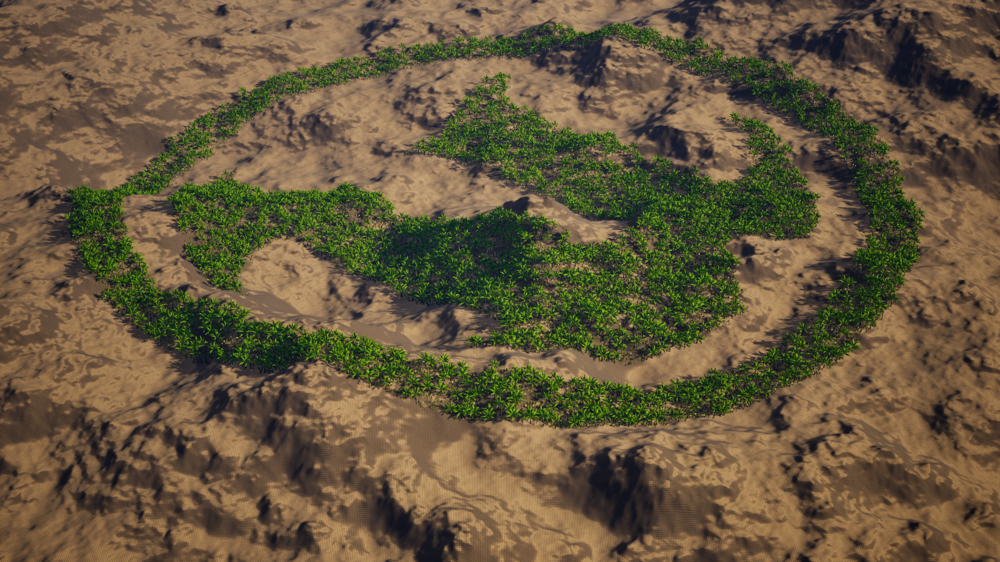
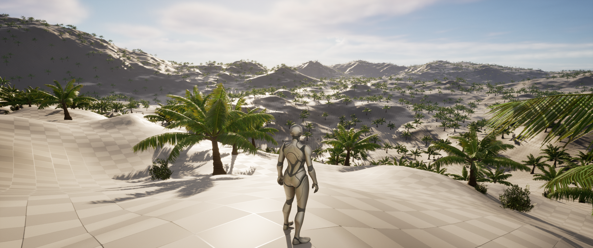

## 2025 Update: 
Project files may be out of date. Will be updated to 5.5 and with improvements soon. Although, this tool is made redundant by PCG, I might return to this project to experiment features.

# Unreal Engine Runtime Foliage Scatter Plugin

A simple Unreal Engine plugin to procedurally scatter Static Mesh foliage instances (bushes and trees) at runtime or in editor using Hierarchical Instanced Static Meshes (HISM), with optional heightfield and mask textures.

<table>
  <tr>
    <td></td>
    <td></td>
  </tr>
  <tr>
    <td></td>
    <td></td>
  </tr>
</table>

---

## Overview

This plugin provides an actor `ARR_FoliageScatter` that:

- Distributes mesh instances across a flat `PlaneBoundsMesh` scaled by `SpawnScale`
- Supports two categories: bushes (`Category = 1`) and trees (`Category ≠ 1`)
- Prevents overlap between assets based on radii (`Radius_1`, `Radius_2`) plus `interFoliage_dist`
- Computes height from a grayscale `HeightfieldTexture`, scaled and offset using `Landscape_Z_Scale` and `Landscape_Z_Offset`
- Optionally masks placement using a binary `FoliageTexture`: only pixels with full white (value = 1.0) pass
- Builds a spatial grid (`GridMap`) for efficient neighbor checking
- Executes on editor `OnConstruction` or via a `CallInEditor` button when `RunCustomConstructionScript` is enabled

---

<table>
  <tr>
    <td></td>
    <td></td>
  </tr>
  <tr>
    <td></td>
    <td></td>
  </tr>
</table>
## Structures & Components

### `F_RR_FoliageAssets`

Defines each foliage type:

- `UStaticMesh* FoliageMesh`
- `Category` (int)
- `Radius_1`, `Radius_2` (float collision radii)
- Default `FTransform`

### `F_RR_TransformsArray`

Holder for `TArray<FTransform>` transforms

---

## Configuration Properties (Editor-Exposed)

- `RunCustomConstructionScript` (bool): trigger generation manually
- `SpawnScale` (float): size multiplier of plane mesh (minimum 10)
- `numIterations` (int): number of random placement attempts
- `interFoliage_dist` (float): additional minimum separation
- `Seed` (int) / `RandomSeed` (bool): reproducible vs random seed
- `Cell_Size`, `Grid_Size`: grid parameters for spatial hashing
- `HeightfieldTexture`, `FoliageTexture` (`UTexture2D*`): placement rules

---

## Workflow

In Construction (or via `Regenerate()`), if enabled:

1. Adjust plane size based on `SpawnScale`
2. Reinitialize seed
3. Compute spawn bounds from plane
4. Build `GridMap`
5. Loop `numIterations`:
   - Choose a random asset and transform (position, rotation, scale)
   - Check no overlap in current cell and neighbors
   - Add transform to appropriate array (`BushTransforms` or `TreeTransforms`)
   - Apply heightfield via `PopulateZFromTexture`
   - If mask enabled: filter transforms via `maskFoliageWithTexture`
6. Call `SpawnInstances()` to add on HISM components

Supports large instance counts efficiently using HISM and cell-based spatial partitioning.

---

## Installation & Usage

Clone or copy into your Unreal Project:  
Place plugin folder under `Plugins/RuntimeFoliageScatter/Source/...`

Compile plugin (Visual Studio or Unreal Build Tool).

In Unreal Editor:

1. Drag `ARR_FoliageScatter` into your level
2. Configure properties in the Details panel:
   - Add entries to `Source Foliage Assets` (mesh, radii, category)
   - Set `SpawnScale`, `numIterations`, and `interFoliage_dist`
   - Assign `HeightfieldTexture` and optionally `FoliageTexture`
   - Set `Seed` or enable `RandomSeed`
   - Enable `RunCustomConstructionScript`, press Regenerate

The actor will scatter foliage in editor immediately and display the result.

---

## Notes & Recommendations

- Ensure `Source_FoliageAssets` entries have correct radii values
- Default mesh scale, grid size, and iteration count should balance density vs performance
- Heightfield texture expects 16-bit grayscale packed in R and G channels: high-value pixels map to higher Z offset
- Mask textures use binary filter: only fully white pixels (mapped z == 1.0) allow placement
- `Cell_Size` should reflect average spatial separation to optimize neighbor search

---

## Extension Ideas

Possible future expansions:

- Support varied mesh scales per asset
- Different exclusion rules per asset type
- Non-planar bounds (e.g., landscape sampling)
- GPU-accelerated placement

---

## Summary Table

| Feature                   | Description                                                   |
|---------------------------|---------------------------------------------------------------|
| Mesh types                | Bushes and trees (Category separating behavior)               |
| Overlap prevention        | Using radii + `interFoliage_dist` and grid-based checks       |
| Heightfield Z-adjustment  | Reads from texture to elevate instances                       |
| Masking                   | Binary placement mask via foliage texture                     |
| Spatial partitioning      | `GridMap` based on `Cell_Size`, efficient overlap testing     |
| Editor integration        | `OnConstruction` logic and `Regenerate()` for manual refresh  |
